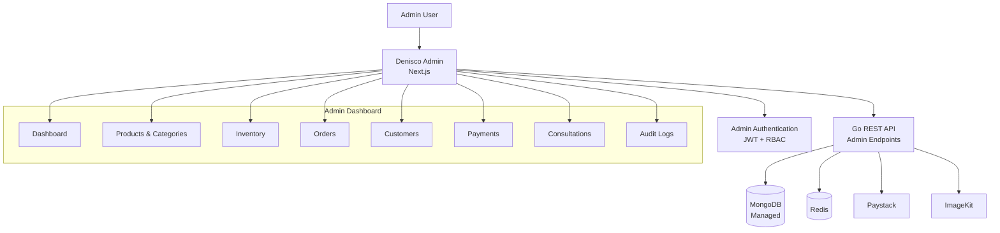

# Denisco Admin

Admin dashboard for **Denisco Global Agriculture Ltd.**

The dashboard provides internal tools for managing products, inventory, orders, customers, payments, consultations and other business operations.

## Tech Stack

* **Framework:** Next.js
* **Language:** TypeScript
* **Data Fetching:** TanStack Query
* **Forms:** React Hook Form + Zod
* **Styling:** Tailwind CSS
* **UI:** shadcn/ui + Lucide
* **Tables:** TanStack Table
* **Charts:** Recharts
* **API:** Denisco Go Backend

## Architecture



## Main Features

* Admin authentication
* Role-based access control
* Business overview dashboard
* Product management
* Category management
* Inventory management
* Order management
* Customer management
* Payment and transaction management
* Consultation booking management
* Audit logs
* Responsive dashboard interface

## Project Structure

```text id="9p7j5c"
denisco_admin/
├── public/
├── src/
│   ├── app/
│   │   ├── login/
│   │   └── dashboard/
│   │       ├── products/
│   │       ├── inventory/
│   │       ├── orders/
│   │       ├── customers/
│   │       ├── payments/
│   │       ├── consultations/
│   │       └── audit-logs/
│   ├── components/
│   ├── features/
│   ├── hooks/
│   ├── lib/
│   ├── providers/
│   └── types/
├── tests/
├── .env.example
├── next.config.ts
├── package.json
├── tsconfig.json
└── README.md
```

## Getting Started

### Requirements

* Node.js
* npm

### Installation

```bash id="qz2r8x"
git clone <repository-url>
cd denisco_admin

npm install
```

Create the environment file:

```bash id="9v5s8k"
cp .env.example .env.local
```

Configure the required variables, then start the development server:

```bash id="6a9x3r"
npm run dev
```

The dashboard will be available at:

```text id="k4t8rm"
http://localhost:3000
```

## Backend

The admin dashboard communicates directly with the Denisco Go API.

```text id="4r6f3x"
Admin Dashboard
      │
      │ HTTPS / JSON
      ▼
Go REST API
      │
      ├── JWT / RBAC
      ├── MongoDB
      ├── Redis
      ├── Paystack
      └── ImageKit
```

Authorization is enforced by the backend. Frontend route protection is only a user-experience layer and must not be treated as the security boundary.

## Product & Design Reference

The approved **HTML/CSS/JavaScript prototype** is the canonical reference for:

* Dashboard layout
* Navigation
* Features
* Admin workflows
* UI components
* Colours
* Typography
* Responsive behaviour

The production dashboard should follow the approved prototype while replacing demo/local-storage behaviour with the production API.

## Development

```bash id="v2c7mn"
npm run dev
```

Build for production:

```bash id="3c4m7k"
npm run build
```

Start production build:

```bash id="r8x1qw"
npm run start
```

Run linting:

```bash id="m2n6kp"
npm run lint
```

## Testing

Tests should cover:

* Authentication
* RBAC and protected routes
* Product management
* Inventory operations
* Order management
* Customer management
* Payment records
* Consultation management
* Form validation
* API error states
* Critical dashboard interactions

## Environment

Example:

```env id="f1s7qd"
NEXT_PUBLIC_API_URL=
```

Only public configuration should use `NEXT_PUBLIC_*`.

Private credentials and secrets must never be committed to the repository.

## Deployment

The admin dashboard is deployed independently from the customer web application and backend.

```text id="e2x5jw"
Internet
   │
   ▼
Cloudflare
   │
   ▼
Next.js Admin
   │
   ▼
Denisco Go API
```

The admin application, customer web application and backend are maintained and deployed as independent projects.
